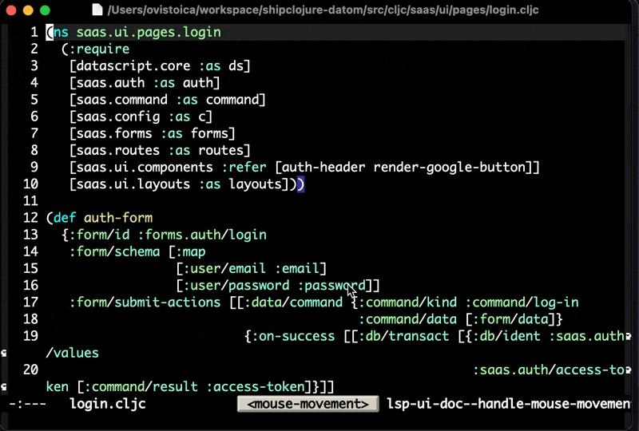

# significant-other.el

Helper functions to jump between significant other files in Emacs.

Many files come in pairs, like tests and source files, header files and implementations, components and their devcards. This package helps you set up functions to jump between these related files.

## Installation

### MELPA (coming soon)

```elisp
(use-package significant-other
  :ensure t
  :bind ("s-j" . significant-other-jump))
```

### Straight.el

With use-package:
```elisp
(use-package significant-other
  :straight '(significant-other :type git :host github :repo "ovistoica/significant-other.el")
  :bind ("s-j" . significant-other-jump))
```

Raw straight:
```elisp
(straight-use-package '(significant-other :type git :host github :repo "ovistoica/significant-other.el"))
(require 'significant-other)
(global-set-key (kbd "s-j") 'significant-other-jump)
```

### Manual Installation

Clone this repository and add it to your load path:

```elisp
(add-to-list 'load-path "/path/to/significant-other")
(require 'significant-other)
```

## Demo



This demo shows jumping between significant other files. The package helps you navigate between related files like:

```
shipclojure-datom/
├── portfolio/saas/ui/pages/
│   └── login_scenes.cljs ←→  src/cljc/saas/ui/pages/login.cljc
│                         ←→  test/cljc/saas/ui/pages/login_test.cljc
├── src/cljc/saas/ui/pages/
│   └── login.cljc        ←→  test/cljc/saas/ui/pages/login_test.cljc
│                         ←→  portfolio/saas/ui/pages/login_scenes.cljs
└── test/cljc/saas/ui/pages/
    └── login_test.cljc   ←→  src/cljc/saas/ui/pages/login.cljc
                          ←→  portfolio/saas/ui/pages/login_scenes.cljs
```

## Usage

The main function is `significant-other-jump` which:
- Jumps directly to the significant other file if only one exists
- Prompts you to choose if multiple significant others exist
- Offers to create a new file if none exist
- With prefix argument (`C-u`), creates and saves the file immediately

### Configuration

Use the `with-significant-others` macro to configure file mappings in mode hooks. Here's the configuration used in the demo:

```elisp
(add-hook 'clojure-mode-hook
  (lambda ()
    (with-significant-others file
      ;; Source files to test and portfolio
      ("/src/cljc/.+\\.cljc$"
       (list (replace-regexp-in-string "/src/cljc/" "/test/cljc/"
               (replace-regexp-in-string "\\.cljc$" "_test.cljc" file))
             (replace-regexp-in-string "/src/cljc/" "/portfolio/"
               (replace-regexp-in-string "\\.cljc$" "_scenes.cljs" file))))

      ;; Test files back to source
      ("/test/cljc/.+_test\\.cljc$"
       (list (replace-regexp-in-string "/test/cljc/" "/src/cljc/"
               (replace-regexp-in-string "_test\\.cljc$" ".cljc" file))))

      ;; Portfolio files back to source
      ("/portfolio/.+_scenes\\.cljs$"
       (list (replace-regexp-in-string "/portfolio/" "/src/cljc/"
               (replace-regexp-in-string "_scenes\\.cljs$" ".cljc" file)))))))
```

### Example Configurations

#### JavaScript/TypeScript

```elisp
(add-hook 'js-mode-hook
  (lambda ()
    (with-significant-others file
      ;; Source to test
      ("\\.js$"
       (list (replace-regexp-in-string "\\.js$" ".test.js" file)
             (replace-regexp-in-string "\\.js$" ".spec.js" file)))

      ;; Test to source
      ("\\.\\(test\\|spec\\)\\.js$"
       (list (replace-regexp-in-string "\\.\\(test\\|spec\\)\\.js$" ".js" file))))))
```

#### C/C++

```elisp
(add-hook 'c-mode-hook
  (lambda ()
    (with-significant-others file
      ;; Header to implementation
      ("\\.h$"
       (list (replace-regexp-in-string "\\.h$" ".c" file)))

      ;; Implementation to header
      ("\\.c$"
       (list (replace-regexp-in-string "\\.c$" ".h" file))))))
```

## Customization

### Multiple File Behavior

When multiple significant other files exist, you can customize the behavior:

```elisp
;; Prompt user to choose (default)
(setq significant-other-multiple-file-behavior 'prompt)

;; Jump to first file automatically
(setq significant-other-multiple-file-behavior 'first)
```

### Test File Detection

Customize the regex pattern for identifying test files:

```elisp
(setq significant-other-test-file-regex "/test/.+\\.spec\\.js")
```

## Functions

- `significant-other-jump` - Interactive function to jump to significant other files
- `significant-other-find-existing` - Find the first existing significant other file
- `significant-other-find-all-existing` - Find all existing significant other files
- `significant-other-find-tests` - Find test files among significant others
- `with-significant-others` - Macro to configure file mappings

## Keybinding

The package doesn't set up keybindings by default. Add your preferred binding:

```elisp
(global-set-key (kbd "s-j") 'significant-other-jump)
```

## Credit

This package was extracted from the original work of [Magnars Sveen](https://github.com/magnars) as part of [emacsd-reboot](https://github.com/magnars/emacsd-reboot/blob/main/settings/significant-other.el). This library is an effort to extract that functionality and make it available to more people.

## License

GPL-3.0